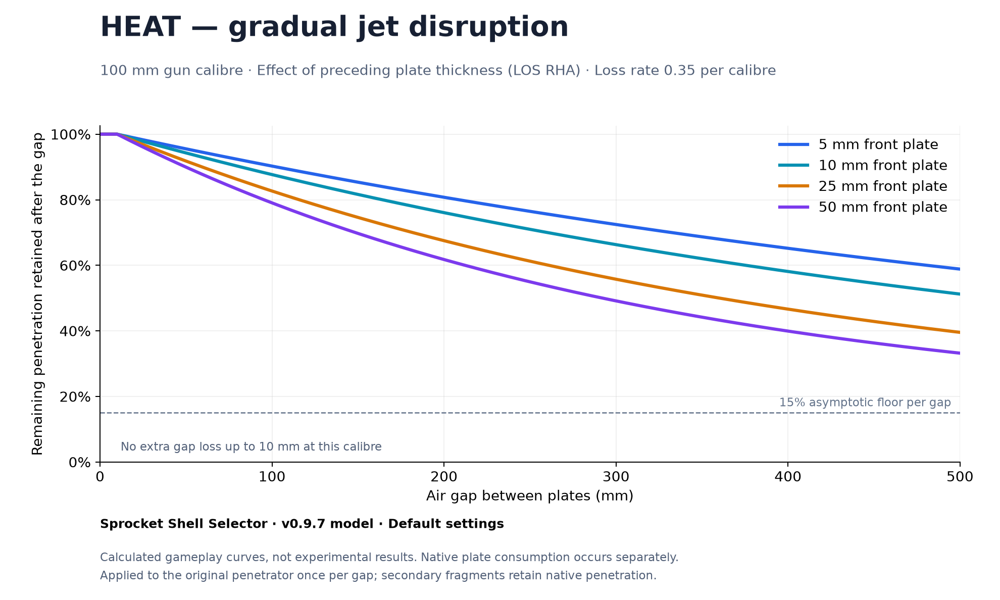
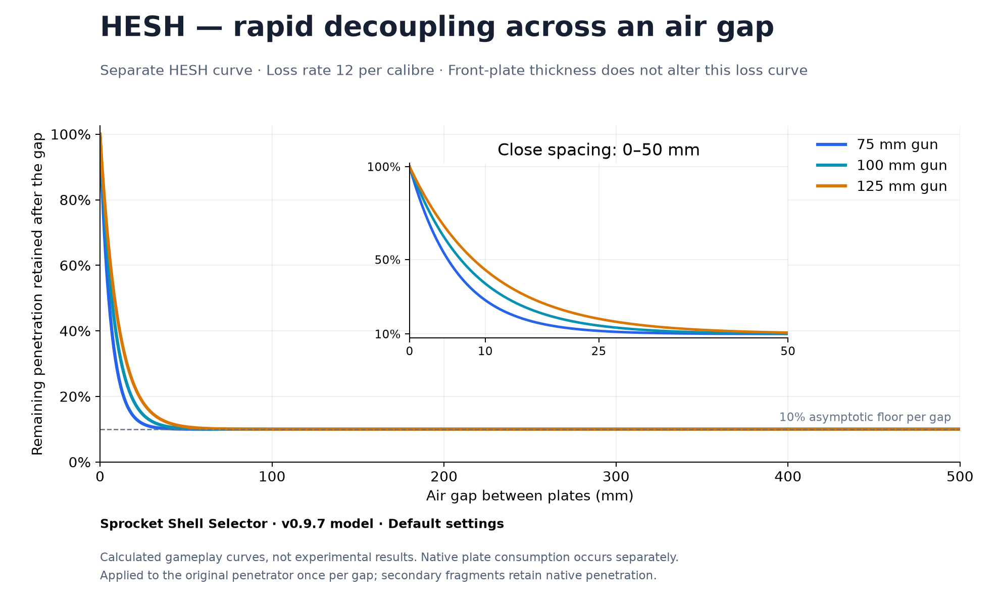

# Spaced armour: HEAT and HESH

These are independent gameplay approximations, not fitted experimental penetration curves. Native armour consumption remains active. Extra gap loss applies to the original penetrator once per measured air gap; secondary fragments keep native penetration.

## Equations

Let C be full gun calibre in mm, T the preceding contiguous plate thickness in line-of-sight RHA mm, and G the free air gap in mm. F is `secondPlatePenetrationFactor`; S is `airGapLossPerCalibre`.

HEAT:

```text
x = S * max(0, G/C - 0.1) * (0.25 + 0.75 * (1 - exp(-T/(0.25*C))))
```

HESH:

```text
x = S * G/C
```

For both:

```text
retention = F + (1-F) * exp(-x)
remaining penetration after gap = CURRENT remaining penetration * retention
```

Defaults: HEAT F=0.15, S=0.35; HESH F=0.10, S=12. Zero sensitivity disables extra gap loss. The floor applies per gap, and multiple gaps compound. Lost penetration is never restored. Very close HEAT layers (up to 0.1 calibre of free gap) incur only native plate consumption. Thicker preceding HEAT plates cause more additional disruption. HESH uses a much faster separate loss curve.

## Curves





The vertical axis shows the fraction of the current budget retained across a gap, not the fraction of initial penetration and not a guaranteed ability to penetrate the next plate. [CSV data](curve-data.csv) and [plot script](plot_curves.py) are included. The script requires NumPy and Matplotlib.

## Validation of v0.9.7

User gameplay/simulator testing accepted the build. A subsequent Shell Selector log audit found no plugin errors or warnings across 312 HEAT and 2 HESH simulator shots. 115 HEAT shots produced multiple spall bursts. All 309 logged gap events matched the equations within printed rounding and reduced or preserved the current budget. Observed gaps ranged from 179.4 to 1720.8 mm. The release source passes 233 standalone managed regression checks.

For a 100 mm HEAT profile after a 50.3 mm LOS RHA plate, a 217.7 mm gap retained 59.2% (362.9 to 214.8 mm); 263.7 mm retained 53.2% (362.9 to 193.2 mm). A HESH sample at 263.8 mm retained 10.0% (195.9 to 19.6 mm).

HESH log coverage is limited to two shots. These results verify implementation and observed simulator behavior; they do not validate physical accuracy or every live firing scenario. HESH remains a perforating spall proxy: true nonperforating backface scabbing is not implemented. HEAT now generates concentrated spall at later successfully penetrated plates without allowing secondary fragments to repeatedly amplify payload bursts. APHE and HESH retain their single amplified payload burst.

## Physical motivation and limits

Plate interaction and free-flight jet disruption motivate the HEAT thickness/spacing dependence; real shaped charges also have an optimum initial stand-off, which this monotonic post-plate gameplay model does not reproduce. See the [shaped-charge study](https://www.nature.com/articles/s41598-026-39841-5) and [stand-off investigation](https://www.mdpi.com/1996-1944/13/4/912). HESH uses a steeper separated-layer penalty to approximate loss of shock coupling; its constants are balance choices, not measured material properties. Blast damage, composite armour and ERA are outside these equations.
